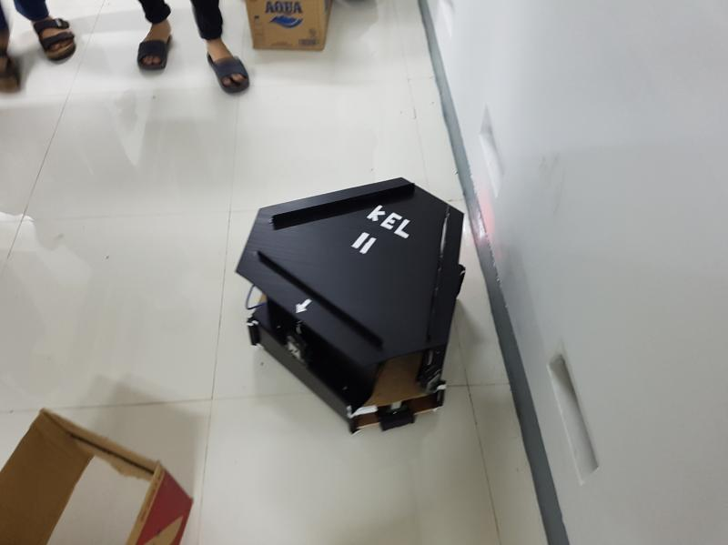

# Tugas Besar Magang 2 Dagozilla

## Group 2:
1. **12920019 Fairuz Amira Mecca** (Official)
2. **11421074 Annisa Aulia Zahra** (Mechanic)
3. **13121075 Muhammad Ridwan** (Mechanic)
4. **13121176 Difa Lauza Akbari** (Mechanic)
5. **13220049 Raihan Fadhil Yanuarsyah** (Electrical)
6. **13221026 Maritza Humaira** (Electrical)
7. **18221128 Fadhlan Nazhif Azizy** (Electrical)
8. **13220022 Muhammad Zaky Hermawan** (Programming)
9. **18221048 Syafiq Ziyadul Arifin** (Programming)
10. **18221096 Fikri Naufal Hamdi** (Programming)



This project was built to read distances from 3 sensors (left, ahead, and right side) and run the motors. Because all of the sensors return values in microseconds, we convert them to centimeters using the following formula: **time us * 0.0343 cm/us / 2**. Also, the PWMs for the motors we use here are ranged from **[-1 .. 1]**, where -1 is spinning counter-clockwise and 1 is spinning clockwise. Because we are using **analogWrite** from Arduino, we convert the PWMs to duty cycle with 8 bits [0... 255].

## How to Use
1. Clone this repository
2. ```cd catkin_ws```
3. ```catkin_make```
4. ```source devel/setup.sh``` (terminal) or ```source devel/setup.zsh``` (bash)
5. Connect the Arduino Mega
6. Launch the Arduino IDE, verify that the port is connected, and upload **arduino/hardware.ino**
7. ```roslaunch command command.launch```
8. **IN CASE OF ACCESS ERROR: ** ```sudo chmod a+rw /dev/ttyACM0``` (increment the least number if the error persists)

## Notes:
- The port can be changed in **catkin_ws/src/command/launch/command.launch**.
- If you're using Arduino Uno, change the *readSensorInt3()* procedure in **hardware.ino** to *ISR(PCINTx_vect)*. Reference: https://arduino.stackexchange.com/questions/70348/pcint0-pcint1-pcint2-etc-on-attiny45-85